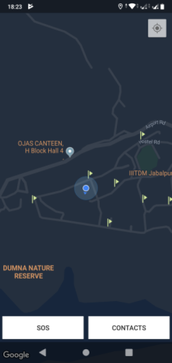
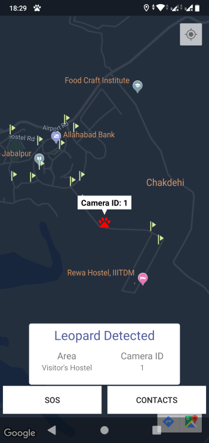
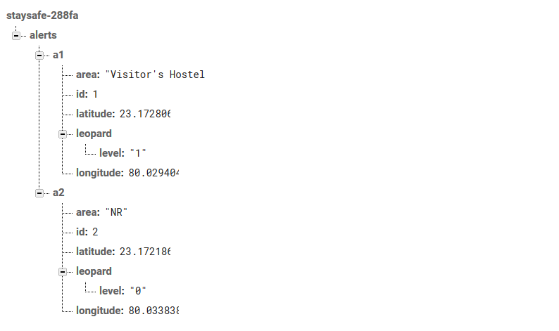

# StaySafe

Android app to warn people of dangerous animals in the area.

## Why StaySafe?
IIITDM Jabalpur campus is located right beside Dumna Nature Reserve. Dumna Nature Reserve is home to many faunae. Out of all of the faunae, Leopards and Deer have frequented the campus by jumping over the boundary walls.

StaySafe is the android application to the IoT based, Image Processing project on Raspberry Pi. This app notifies users about the location where the leopard has been detected in real-time and also provides an SOS button and Emergency Contacts. This way, users can stay away from areas where leopards are detected frequently.
 

  

                               

## The Motivation
StaySafe was created as part of 'Safty and Security in IIITDM Jabalpur', a project for DS302 - Engineering Design. Primarily, the idea was made because of all the security concerns related to wild animals, in this case, leopards.

## Working
The applicaion conains a map with location of every Security Guard Checkpoint marked as a flag. If at any point, a leopard is detected, it is updated in the Firebase Database under 'leopard/level' is marked "1". After 2 minutes, this data value will turn zero automatically.

  

 
 
 The Image Processing that is used to detect leopaprds can be found on [this repository](https://github.com/arnav-deep/leopard-detection).

Whenever 'leopard/level' equals to "1", a notification is pushed by the app.

## Developers
The app was developed initially in November 2019, as part of the project 'Safty and Security in IIITDM Jabalpur' by [Arnav Deep](https://github.com/arnav-deep), [Shivam Dubey](https://github.com/shushvam) and [Kaushal Sharma](https://github.com/shkaushal).

## License
GNU GENERAL PUBLIC LICENSE Version 2

Arnav Deep © November 2019. All rights reserved.
